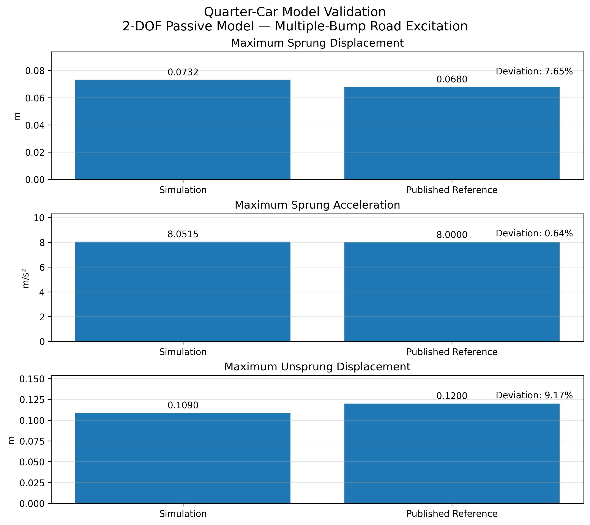
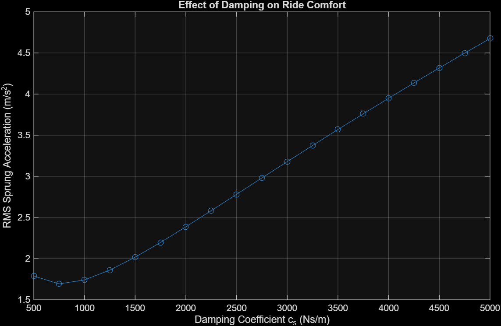
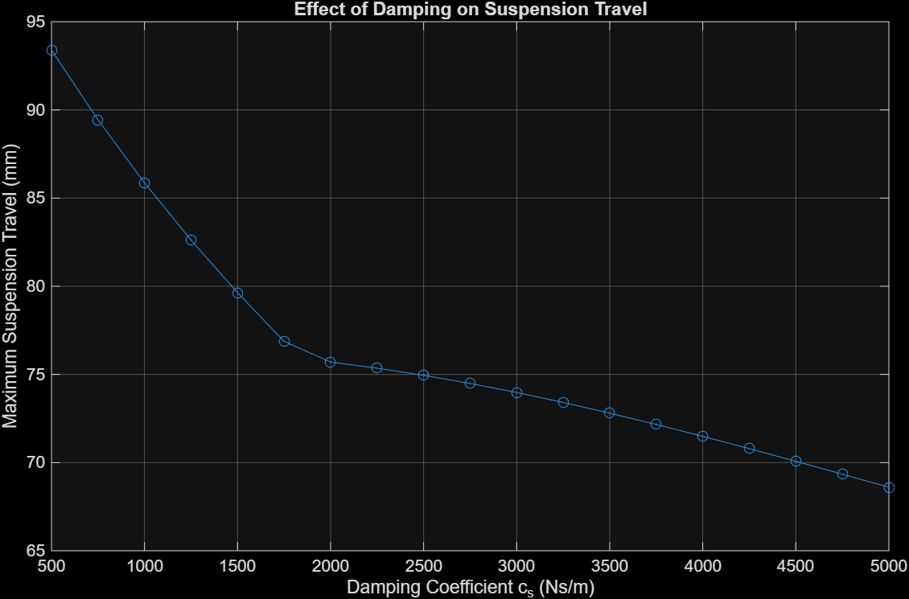
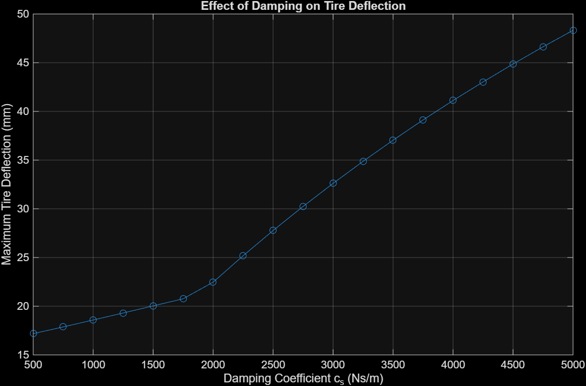
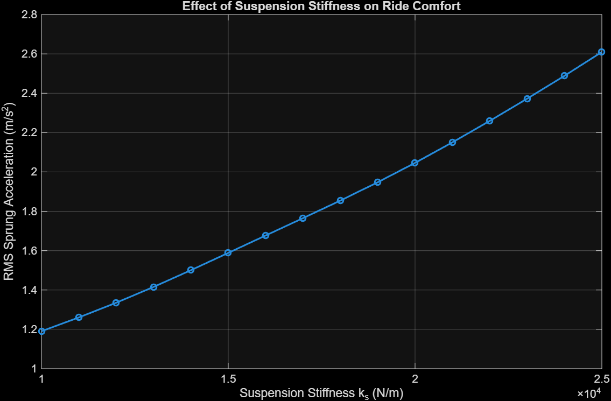
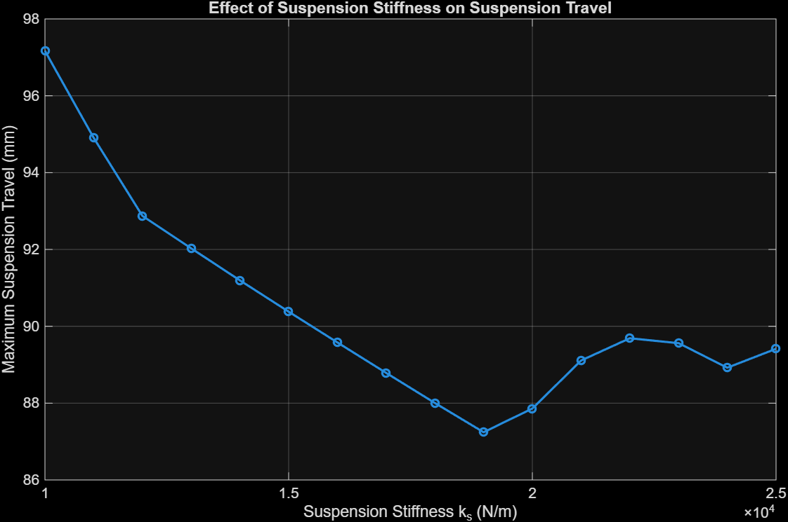
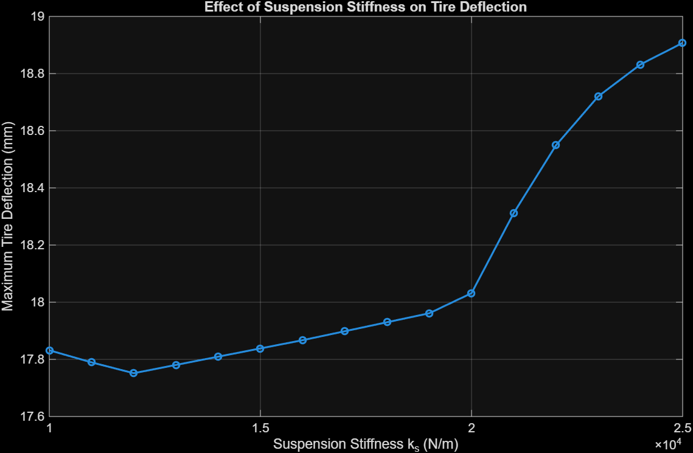

# Simulation, Validation and Parametric Analysis of a 2-DOF Quarter-Car Suspension

A MATLAB/Simulink study of a passive two-degree-of-freedom quarter-car suspension under multiple-bump road excitation.

## Highlights
- Passive 2-DOF quarter-car model in MATLAB/Simulink.
- Response-level validation against published multiple-bump results.
- Damping sweep: 500–5000 Ns/m.
- Stiffness sweep: 10,000–25,000 N/m.
- Combined stiffness-damping sweep: 304 simulations.
- Metrics: RMS sprung acceleration, maximum suspension travel, maximum tire deflection, and maximum dynamic tire force.

## Model
The model contains sprung mass `m_s`, unsprung mass `m_u`, suspension spring `k_s`, damper `c_s`, tire stiffness `k_t`, and road displacement `z_r`.

Dynamic equations:

$$m_s\\ddot z_s + c_s(\\dot z_s-\\dot z_u)+k_s(z_s-z_u)=0$$

$$m_u\\ddot z_u-c_s(\\dot z_s-\\dot z_u)-k_s(z_s-z_u)+k_t(z_u-z_r)=0$$

Dynamic tire force:

$$F_t=k_t(z_u-z_r)$$

## Road Excitation

| Bump | Amplitude | Time interval |
|---|---:|---:|
| 1 | 0.10 m | 0.50–0.75 s |
| 2 | 0.05 m | 3.00–3.25 s |
| 3 | 0.10 m | 5.00–5.25 s |

Implemented in `MATLAB/multiple_bump.m`.

## Validation

| Parameter | Value |
|---|---:|
| Sprung mass | 290 kg |
| Unsprung mass | 59 kg |
| Suspension stiffness | 16,182 N/m |
| Suspension damping | 1,000 Ns/m |
| Tire stiffness | 190,000 N/m |

| Metric | Simulation | Published reference | Difference |
|---|---:|---:|---:|
| Maximum sprung displacement | 0.0732 m | 0.0680 m | 7.65% |
| Maximum sprung acceleration | 8.0515 m/s² | 8.0000 m/s² | 0.64% |
| Maximum unsprung displacement | 0.1090 m | 0.1200 m | 9.17% |

The published values are approximate values read/reported from response plots, so this is response-level validation rather than exact reproduction of the original simulation data.



## Parametric Studies

### Damping
500–5000 Ns/m, 250 Ns/m increments.







### Stiffness
10,000–25,000 N/m, 1,000 N/m increments.







### Combined stiffness-damping study
16 stiffness values × 19 damping values = 304 simulations. The complete CSV records all four response metrics.

## How to Run

Requirements: MATLAB and Simulink.

1. Open `Simulink/QuarterCar_Validation.slx` and run `MATLAB/run_validation.m` for validation.
2. Run `MATLAB/parametric_damping.m` for the damping sweep.
3. Run `MATLAB/parametric_stiffness.m` for the stiffness sweep.
4. Run `MATLAB/combined_ks_cs_sweep.m` for the 304-case study.
5. Use the plotting scripts to visualize the generated result tables.

## Repository Structure

```text
Simulink/   -> QuarterCar_Validation.slx, QuarterCar_Study.slx
MATLAB/     -> model parameters, road profile, validation and sweep scripts
Results/    -> validation figures, parametric plots and CSV datasets
```

## Limitations
- Passive 2-DOF representation only.
- Prescribed road excitation; no measured road data.
- No pitch, roll, lateral, or full-vehicle dynamics.
- Linear tire stiffness model.
- Published validation values are approximate plot-derived references.

## References
1. T. P. Phalke and A. C. Mitra, *Analysis of Ride Comfort and Road Holding of Quarter Car Model by SIMULINK*, Materials Today: Proceedings, 2017.
2. A. Tiwari et al., *Study of Road Holding and Ride Comfort Analysis with the Help of Quarter Car Model*, International Journal of Scientific Development and Research, 2018.

## Author
**Maitreya Birhade** — B.Tech Mechanical Engineering, IIT Indore